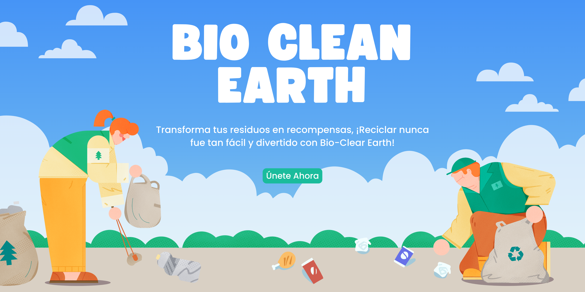

# ♻️ Bio-Clean Earth

**Bio-Clean Earth** es una aplicación diseñada para motivar y facilitar el reciclaje a través de una plataforma interactiva que educa, recompensa y guía a los usuarios en el proceso de separación de residuos. Esta plataforma tiene como objetivo resolver el problema de la falta de conocimiento y motivación para reciclar, ofreciendo una solución práctica que incentiva la participación mediante puntos y recompensas.



## 📋 Tabla de Contenidos
1. [Introducción](#introducción)
2. [Características Principales](#características-principales)
4. [Instalación](#instalación)
5. [Uso](#uso)
6. [Resultados del Proyecto](#resultados-del-proyecto)
7. [Contribuciones](#contribuciones)
8. [Licencia](#licencia)

## 🌍 Introducción

El reciclaje es un proceso clave para la preservación del medio ambiente, pero muchas personas aún no reciclan debido a la falta de conocimiento y motivación. **Bio-Clean Earth** busca cambiar eso, proporcionando una plataforma accesible y divertida que incentiva a los usuarios a participar activamente en el reciclaje.

## 🚀 Características Principales

1. **🔑 Inicio de Sesión y Registro de Usuarios**  
   Los usuarios pueden registrarse y crear una cuenta única con la cual podrán acceder a todas las funcionalidades de la plataforma. 

2. **📊 Dashboard de Reciclaje**  
   El panel principal muestra un balance completo de los puntos acumulados y la cantidad total de residuos reciclados. Se divide en tres categorías:
   - ♻️ **Aprovechables**
   - 🚮 **No Aprovechables**
   - 🍂 **Orgánicos**

3. **📈 Registro de Actividades**  
   Se presenta un historial de las actividades recientes de otros usuarios, incentivando una competencia sana y comunitaria en la que todos pueden ver los logros de los demás.

4. **🔄 Sistema de Reciclaje**  
   Los usuarios seleccionan la cantidad de residuos que han reciclado y los clasifican en las tres categorías principales. La app automáticamente calcula los puntos obtenidos por cada reciclaje y los añade al perfil del usuario.

5. **🏆 Puntuación y Ranking de Usuarios**  
   Se muestra una tabla con el puntaje acumulado por cada usuario, fomentando una competencia amistosa para ver quién recicla más y quién obtiene más puntos.

6. **🎁 Premios y Recompensas**  
   Los usuarios pueden canjear sus puntos por diversos premios, que van desde stickers ecológicos hasta tarjetas de regalo. Esto motiva a los usuarios a seguir participando y reciclando más.

7. **📚 Base de Datos de Residuos**  
   Una lista o grilla que contiene información detallada sobre diferentes tipos de residuos. Los usuarios pueden aprender dónde deben depositarlos, si son aprovechables o no, y en qué pueden convertirse después de ser reciclados.

## 🛠️ Instalación

### Instalación Local con XAMPP/WAMP

1. **Descarga e instala** [XAMPP](https://www.apachefriends.org/index.html) o [WAMP](https://www.wampserver.com/en/), que incluyen Apache, MySQL y PHP.

2. **Clona el repositorio** en el directorio de tu servidor local:
    - Para XAMPP: Copia el proyecto en la carpeta `htdocs`:
      ```bash
      git clone https://github.com/PuelloJ/bio-clean-earth.git C:/xampp/htdocs/bio-clean-earth
      ```
    - Para WAMP: Copia el proyecto en la carpeta `www`:
      ```bash
      git clone https://github.com/PuelloJ/bio-clean-earth.git C:/wamp64/www/bio-clean-earth
      ```

3. **Configura la base de datos**:
    - Abre **phpMyAdmin** desde el panel de XAMPP o WAMP.
    - Crea una base de datos llamada `bioclean_earth`.
    - Importa el archivo `bioclean_earth.sql` que se encuentra en el repositorio:
      1. Ve a la pestaña "Importar" en phpMyAdmin.
      2. Selecciona el archivo `bioclean_earth.sql` y haz clic en "Continuar".

5. **Inicia Apache y MySQL** desde XAMPP o WAMP.

6. **Accede a la aplicación**:
    - Abre tu navegador y ve a `http://localhost/` para empezar a usar la aplicación.

### Uso de la Aplicación Web
Una vez configurada localmente, la aplicación estará lista para ser utilizada a través de tu navegador en el entorno local.


## 🎮 Uso

1. **Registrarse/Iniciar Sesión**  
   Una vez registrado, el usuario puede iniciar sesión y acceder a su tablero de reciclaje.

2. **Clasificar y Reciclar**  
   - Selecciona el tipo de residuo.
   - Introduce la cantidad que has reciclado.
   - La aplicación calculará automáticamente los puntos obtenidos.

3. **Consultar tu Balance**  
   Accede al panel para ver la cantidad total de residuos reciclados, desglosados por categoría, y tu puntaje total acumulado.

4. **Canjear Premios**  
   Visita la sección de **Premios** para ver qué puedes canjear con tus puntos y sigue los pasos para reclamar tu recompensa.

5. **Consultar la Base de Datos de Residuos**  
   Aprende más sobre los residuos y cómo clasificarlos correctamente.

## 🤝 Contribuciones

¡Nos encantaría recibir tus contribuciones! Por favor, sigue los siguientes pasos:
1. Haz un **fork** del repositorio.
2. Crea una nueva **rama**:
    ```bash
    git checkout -b feature/nueva-funcionalidad
    ```
3. Realiza tus cambios y **haz commit**:
    ```bash
    git commit -m "Añadir nueva funcionalidad"
    ```
4. Envíanos un **Pull Request**.

## ⚖️ Licencia

Este proyecto está licenciado bajo la Licencia MIT. Para más detalles, consulta el archivo [LICENSE](LICENSE).
